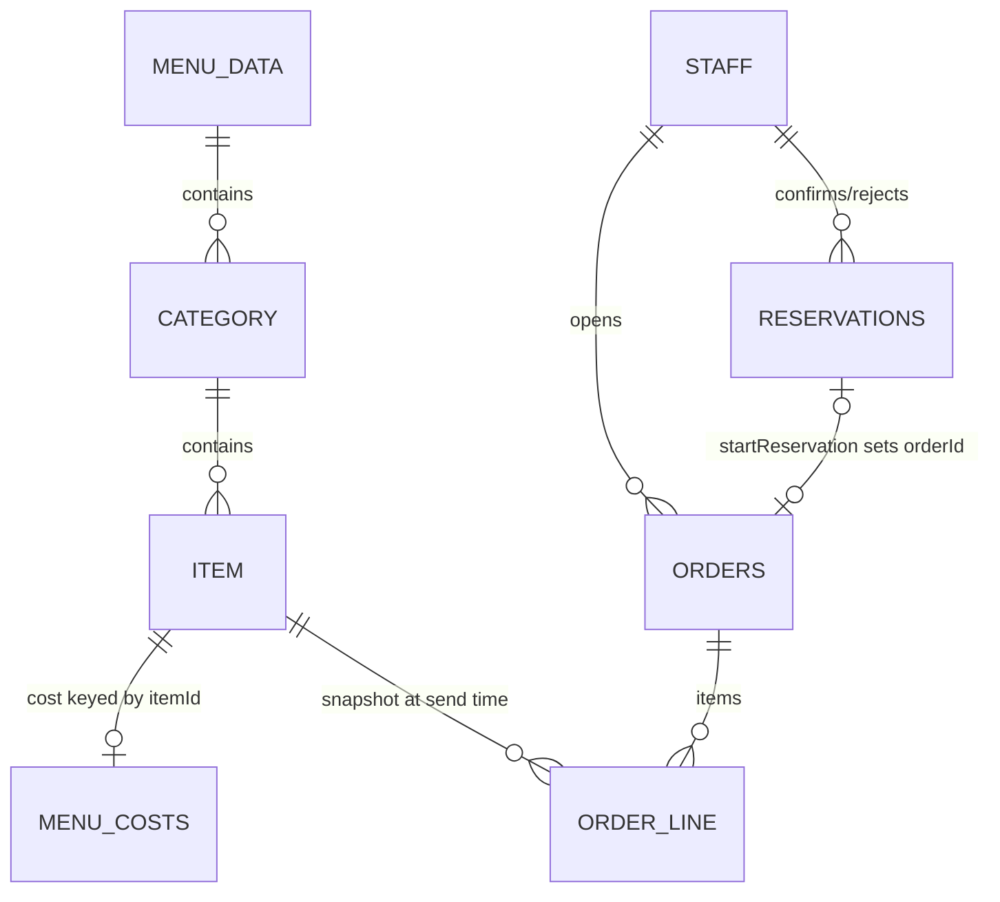

# Data model (Firestore)

Firestore is schemaless — this document describes the shape the app's code
actually reads and writes, not an enforced schema. `firestore.rules` is the
only place access is actually constrained. For `orders` and `reservations`,
this is a condensed reference; [`comande-camerieri.md`](comande-camerieri.md)
and [`prenotazioni.md`](prenotazioni.md) are the full design docs (lifecycle,
rationale for each decision) and take precedence if this page and those
disagree.

## `menu/data` (single document)

The entire public menu. Public read, authenticated write
(`firestore.rules`). No dedicated data-layer module — read/written directly
by `MenuApp.jsx`.

| Field | Type | Notes |
|---|---|---|
| `restaurantName`, `tagline`, `location`, `footerNote` | string | |
| `theme` | string | One of the keys in `THEMES` (`src/shared.jsx`): `rustica`, `ciro`, `uliveto`, `minimal`. |
| `searchEnabled` | boolean | Missing/`true` = the dish search bar is shown; introduced after launch, so absence means "on". |
| `coperto` | `{ adults: string, children: string }` | Per-person cover charge, Italian-format price strings (e.g. `"2,50"`). |
| `categories` | array of Category (below) | Order in the array is display order. |
| `translations` | `{ [langCode]: Translation }` | `langCode` ∈ `en, es, de, fr` (see `LANGUAGES` in `shared.jsx`); no `it` key, Italian is the source data above. |
| `reviewLinks` | `{ google?: LinkEntry, tripadvisor?: LinkEntry }` | |
| `socialLinks` | `{ instagram?: LinkEntry, facebook?: LinkEntry, shop?: LinkEntry }` | |

**Category**: `{ id: string, name: string, subtitle: string, visible: boolean, items: Item[] }`

**Item**: `{ id: string, name: string, price: string, description: string, tag?: string, image?: string, visible: boolean, staffOnly: boolean }`
— `price` is an Italian-format string (`"12,50"`) or a free-text value like
`"SU RICHIESTA"` (rendered specially, see `renderPrice` in `ClientView.jsx`).
`staffOnly` items are never shown on the public menu but are orderable from
Waiter's "Fuori menù" section.

**Translation**: `{ restaurantName?, tagline?, footerNote?, categories: { [catId]: { name?, subtitle?, items: { [itemId]: { name?, description?, tag? } } } } }`
— every field is optional per-entry (falls back to the Italian source, see
`applyTranslation` in `shared.jsx`); a field is never left `undefined`
though (Firestore rejects nested `undefined`), it's `""` when there's
nothing to translate.

**LinkEntry**: `{ url: string, visible: boolean }`

## `menuCosts/data` (single document)

Internal dish costs, used only to compute margin in the Stats dashboard.
Kept in a document separate from `menu/data` specifically because
Firestore has no field-level rules — this is the only way to keep it from
being visible in the public menu's network response. Authenticated
read/write only.

```
{ [menuItemId]: "3,50" }   // same price-string format as Item.price
```

No entry for an item means "no cost set" — Stats excludes those lines from
the margin instead of treating them as zero cost.

## `staff/{uid}` (one document per staff member)

Role assignment for a Firebase Auth user. The `uid` is the Firebase Auth
uid (accounts themselves are created by hand in the Firebase console — see
`docs/comande-camerieri.md` §3). Authenticated read/write (any signed-in
user can read/write any `staff` doc — see "Trust boundary" below).

| Field | Type | Notes |
|---|---|---|
| `name` | string | Display name, shown as "Ciao, {name}" etc. |
| `role` | string | `"admin"`, `"waiter"`, or `"kitchen"`. Any other value (or a missing doc) is a valid state the UI handles explicitly (`useStaffSession` in `staff-shared.jsx`: `"no-role"` / an unrecognized role → "Accesso non consentito"). |

## `orders/{orderId}`

One document per table order. See `docs/comande-camerieri.md` §4.2 for the
full field list and lifecycle (open → closed/auto_closed, the receipt
sub-object, the 24h auto-close). Key points not to duplicate here:
- `items[]` lines are a point-in-time snapshot of name/price/category/cost
  at send time — renaming a dish or changing its price later never changes
  historical orders or stats.
- `closedAt: null` on an open order, set on close; combined with `status`,
  this is what both the realtime "open orders" listener and the paginated
  history query filter on.
- Orders are never deleted automatically (permanent history for Stats);
  admin-only manual deletion exists (`OrderHistory.jsx`).

## `reservations/{id}`

One document per table reservation. See `docs/prenotazioni.md` §3 for the
full field list and status lifecycle (`pending → confirmed → started`, or
`rejected`/`cancelled`/`no_show`). Key point: `date` is stored as a local
`"YYYY-MM-DD"` string, not a Firestore `Timestamp` — see the note in
`reservationsData.js`'s `dateKey()` for why (avoids UTC/local timezone bugs
for date-range queries).

## Trust boundary (`firestore.rules`)

Every collection above except `menu/data` reads requires
`request.auth != null` for both read and write; `menu/data` allows public
read. There is **no per-role enforcement in the rules** — any authenticated
user (i.e. any staff account) can read/write any collection, including
`staff/{uid}` itself. Role-based restrictions (a waiter can't access Stats,
etc.) are enforced only in the UI. This is a deliberate, documented
trade-off (see `firestore.rules`'s inline comments and `ROADMAP.md`'s
"Sicurezza account admin" note): staff accounts are created by hand by the
admin, not self-registered, so the threat model treats any authenticated
account as trusted personnel.

## Entity relationships


